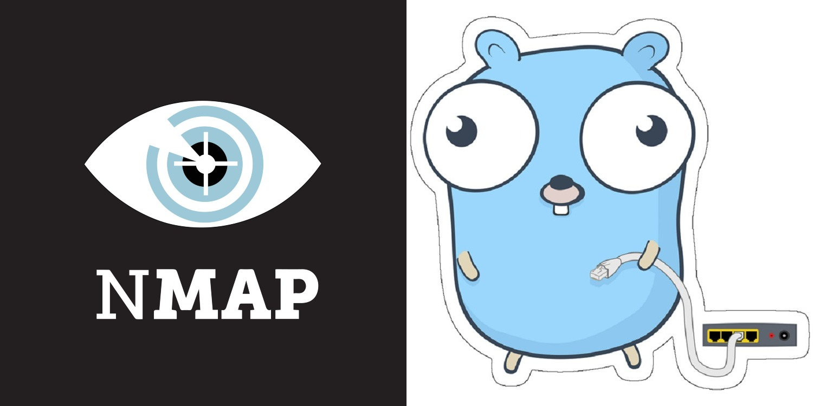

# Go-Nmap

A simple and efficient TCP port scanner implemented in Go. This tool allows users to scan all TCP ports on a specified hostname or IP address to identify open ports. 
This project can be an alternative to nmap. I don't like nmap very much because it is hard to run on Windows.


# Features

- Much faster and lighter than Nmap
- Scans all TCP ports (1-65535) on a specified hostname or IP address.
- Displays open ports in a nicely formatted ASCII table.
- Runnable on Windows and Linux
- Lightweight and fast scanner


# Installation
To use this package, you need to have Go installed on your machine. If you don't have Go installed, you can download and install it from here.


1. Clone the repository:
```bash
   git clone https://github.com/mohammadhasanii/go-nmap.git
```

2. Run the application
 ```bash
   go run main.go 
```
# Usage
Once the application is running, it will display a table with the current weather data for the specified cities. The table will be updated every 10 minutes, and a countdown timer will show the time remaining until the next update.

# Dependencies
- Go 1.16 or later
- [tablewriter](https://github.com/olekukonko/tablewriter) Go package (for table formatting)

# Example Output

```mathematica

  _______   ______          .__   __. .___  ___.      ___      .______   
 /  _____| /  __  \         |  \ |  | |   \/   |     /   \     |   _  \  
|  |  __  |  |  |  |  ______|   \|  | |  \  /  |    /  ^  \    |  |_)  | 
|  | |_ | |  |  |  | |______|  . `  | |  |\/|  |   /  /_\  \   |   ___/  
|  |__| | |  `--'  |        |  |\   | |  |  |  |  /  _____  \  |  |      
 \______|  \______/         |__| \__| |__|  |__| /__/     \__\ | _|      
                                                                         
         


Enter hostname or IP address (or type 'exit' to quit): google.com
Scanning ports on google.com...
Please wait \
We were able to find 1 open TCP ports
|------|----------|--------|
| PORT | PROTOCOL | STATUS |
|------|----------|--------|
|   80 |   TCP    |  OPEN  |
|------|----------|--------|

Port scanning completed in 12s.

Done!  want to scan another IP address? (yes/no):
```

# Building
For Windows:
```bash
 go build -o main.exe
```
For Linux:
```bash
GOOS=linux GOARCH=amd64 go build -o main
```





# Contributing
If you would like to contribute to this project, please fork the repository and submit a pull request.